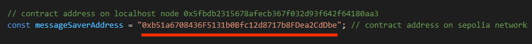

# Message Saver smart contract

This project is a simple example on how to code a smart contract and interact with it with react.js

The contract is deployed on Alchemy using Sepolia network

- Live Version: https://m-mohammad25.github.io/Message-Saver-Smart-Contract/

<b>Note:</b> you must have an Alchemy account and a MetaMask wallet containing Sepolia Ether (test ether) to use the app online
or you can run the app locally using Hardhat tool.

## How To Run The App

### On Localhost

1. on the project directory, run `npx hardhat node`
   Running the above command, you will get the RPC endpoint as well as a list of locally generated accounts. We will need the endpoint as well as the private keys for configuring Metamask.

2. now, we need to add a local network to Metamask. In a browser with Metamask installed, select the network dropdown (this will likely be the dropdown with “Ethereum Mainnet” listed). Do note that you will need to have enabled “Show test networks” in order to view the full list as per the below screenshot.

Select "Add Network" and a new tab will be opened in your browser listing types of networks to choose from.
from the buttom of the page, click "add a new network manually"

After that, will be greeted with a form requesting for the relevant network details.

In order to connect to our local network, we will be using the following:

- Network name: localhost 8545
- New RPC URL: http://127.0.0.1:8545/
- Chain ID: 1337
- Currency symbol: ETH

Then click "save"

3. now, we need to import test accounts.
   Upon starting up the local network, Hardhat has also funded a list of accounts with the native test ETH. In order to add these accounts to Metamask, we will need to add the private keys which were returned when we ran the `npx hardhat node` command.

With the private keys in hand, we can then select the accounts tab on Metamask (this is the colourful circle on top) which will display various options for connecting an account.

select "Add account or hardware wallet".

then select "Import account"

after that, Metamask will prompt you for the private key string. Paste the private keys from earlier, it should look something like this: `0xac0974bec39a17e36ba4a6b4d238ff944bacb478cbed5efcae784d7bf4f2ff80`

then click "Import" and once imported, an account with the corresponding address will have been added to Metamask. You should also be able to see a 10000 ETH in the imported account.

4. now we need to deploy our smart contract.

On a NEW CONSOLE, run `npx hardhat run .\scripts\deploy.ts --network localhost` and should see a message saying: MessageSaver deployed to: (some address)

Make sure that the address which our contract has been deployed to matches the value of `messageSaverAddress` variable in `./src/helpers.ts` file, unless, just make the value of the variable as the same as the contract address.

5. finally, run `npm start` command and a new tab will be opened in your browser so you can use the app.

